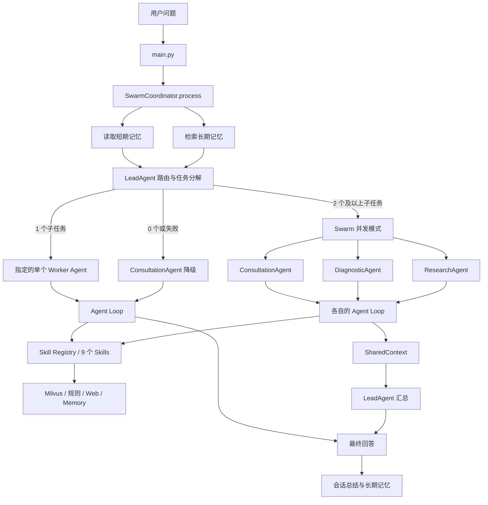

# 医疗助手 Agent 项目学习指南

> 面向人群：学过 LangChain、LangGraph 等 Agent 基础概念，但第一次阅读完整项目的初学者。  
> 学习范围：只分析 `medix-agent-swarm` Agent 应用，不包含任何模型训练内容。  
> 分析基准：当前工作区实际源码、配置结构、README、测试脚本和 Agent 相关 PDF 页面。  
> 重要提醒：这是学习型原型，不是可直接用于真实诊疗的医疗系统。

---

## 1. 先给结论

### 1.1 这个项目是什么

这是一个用 Python 手写编排逻辑的多 Agent 医疗问答原型。它没有直接使用 LangChain AgentExecutor，也没有使用 LangGraph `StateGraph`，而是自行实现了以下能力：

- 一个 `while` 循环形式的 ReAct 风格 Agent Loop；
- 9 个可动态发现并转换成 OpenAI function calling schema 的 Skill；
- 3 个专业 Worker Agent：咨询、诊断分析、医学研究；
- 1 个 LeadAgent：使用 LLM 判断问题并分配 Worker；
- 1 个 SwarmCoordinator：负责路由、并发执行、超时和结果汇总；
- 一个进程内共享黑板 `SharedContext`；
- 短期会话记忆和 Mem0 长期记忆；
- Milvus Lite 医学知识库与 DeepResearch；
- YAML 约束、输出检查、自动补免责声明、记忆去重压缩等原型级安全机制。

一句话概括：

> 用户问题先经过 LLM 路由，再由一个或多个专业 Agent 执行“LLM 决策 → Skill 调用 → 观察结果 → 生成回答”，最后返回统一格式的医疗建议。

### 1.2 它和你学过的 LangGraph 有什么关系

它实现了很多与 LangGraph 相同的概念，但实现方式更原始、更直接：

| 本项目 | LangGraph / LangChain 中的近似概念 | 说明 |
|---|---|---|
| `AgentLoop.run()` 的 `while` | 带循环边的 `StateGraph` / ReAct Agent | 用循环和条件分支代替图节点与边 |
| `AgentState` | Graph State | 保存任务状态、迭代次数、中间结果和最终结果 |
| `SkillRegistry` | Tool 集合 | 将普通 Python 函数转成 function calling schema |
| LLM 返回 `tool_calls` | Tool calling | 模型自主决定调用哪个函数及其参数 |
| `LeadAgent` | Supervisor / Router | 先分解任务，再指定 Worker |
| `SwarmCoordinator` | Orchestrator | 负责创建任务、并发执行、超时和汇总 |
| `SharedContext` | 共享 Graph State / Blackboard | 多 Agent 通过共享对象间接交换结果 |
| `ShortTermMemory` | Checkpointer 的部分用途 | 保存会话消息，但不是 LangGraph 检查点 |
| `LongTermMemory` | Store / Semantic Memory | 使用 Mem0 检索跨会话相似内容 |

关键区别：项目没有声明式图结构、节点级持久化、interrupt、time travel、durable execution 等 LangGraph 能力。阅读时不要强行寻找 `StateGraph`，重点看普通 Python 控制流。

### 1.3 当前代码能否直接运行

按当前文件快照，不能直接按 README 启动。至少有以下独立阻塞：

1. `swarm/__init__.py`、`shared_context.py` 等导入 `swarm.events`，但实际只有 `events_20260428_231035.py`。
2. `validation/__init__.py` 导入 `validation.auto_fixer`，但实际只有 `auto_fixer_20260428_231043.py`。
3. `core/llm_client.py` 写入了旧 Mac 绝对路径，然后执行 `from config import LLM_CONFIG`；README 又要求在上层目录创建 `config.py`。在 Windows 下从 `medix-agent-swarm` 启动时，上层目录不一定在 `sys.path`。
4. 当前可用的 Python 运行环境没有安装项目 requirements，因此本次没有运行完整测试或调用外部服务。

这不妨碍学习架构，但要把“理解设计”和“证明能运行”分开。

---

## 2. 你应该怎样看待这个项目

建议把它当成一个“功能覆盖较广、工程完整度有限的 Agent 原型”：

- 值得学习：手写 Agent Loop、function calling、动态 Skill 注册、Supervisor 路由、asyncio 并发、短期/长期记忆、RAG、降级思路。
- 需要批判性阅读：README、PDF 和注释中有版本漂移，也有一些没有当前证据支持的性能指标。
- 不应直接用于医疗决策：关键词安全检查和免责声明无法替代临床验证、数据治理、合规审查与人工医生。

本项目自带材料声称基于 500 条数据取得若干准确率和响应时间指标，但当前目录没有对应的评测数据集、评测脚本、原始结果或 Git 历史。本指南不会把这些数字当作已验证事实。

---

## 3. 项目目录地图

```text
medix-agent-swarm/
├── main.py                         # 命令行交互入口
├── core/                           # 单 Agent 执行内核
│   ├── llm_client.py               # OpenAI 兼容 API + tool_calls 解析
│   ├── agent_loop.py               # 核心 while 循环
│   ├── state_manager.py            # AgentState 与状态管理
│   ├── skill_loader.py             # 扫描并动态加载 Skill
│   └── skill_registry.py           # 注册、执行、转 OpenAI tools schema
├── agents/                         # Worker Agent
│   ├── base_agent.py               # 抽象基类
│   ├── skill_registry_mixin.py     # 统一注册全部 Skill
│   ├── consultation_agent.py       # 健康咨询
│   ├── diagnostic_agent.py         # 症状与鉴别分析
│   └── research_agent.py           # 指南与证据研究
├── swarm/                          # 多 Agent 协作
│   ├── lead_agent.py               # LLM 路由、任务分解、结果汇总
│   ├── swarm_coordinator.py        # 单/多 Agent 路由与并发调度
│   ├── shared_context.py           # 共享黑板、子任务、贡献
│   └── events_*.py                 # 当前文件名与导入名不一致
├── .claude/skills/                 # 9 个 Skill 定义与脚本
├── memory/                         # 短期、长期、总结、身份和熵管理
├── knowledge/                      # Milvus Lite 知识库与本地资料
├── research/                       # 网络搜索、证据综合、DeepResearch
├── constraints/                    # Agent 与 Swarm YAML 约束
├── validation/                     # 输出自动修复，当前文件名不匹配
├── examples/test_all.py            # 自定义的 26 项异步测试脚本
├── requirements.txt                # 运行依赖
└── README.md                       # 项目说明，部分内容与代码有漂移
```

推荐把目录分成 5 层：

| 层 | 目录 | 负责什么 |
|---|---|---|
| 接入层 | `main.py` | 接收用户输入、显示结果 |
| 编排层 | `swarm/` | 路由、拆分、并行、汇总 |
| Agent 层 | `agents/`、`core/` | 提示词、循环、状态、工具调用 |
| 能力层 | `.claude/skills/`、`research/` | 执行检索、风险分析和研究 |
| 数据与治理层 | `knowledge/`、`memory/`、`constraints/` | 知识、记忆、安全约束 |

---

## 4. 总体架构与请求流



注意：图中多 Agent 分支是并行的，但路由和任务分配是中心化的。LeadAgent 明确返回 `assigned_agent`，Coordinator 再按这个字段派发任务。

---

## 5. 从入口开始追一次请求

### 5.1 `main.py` 做了什么

核心入口是 `interactive_mode()`：

1. 生成一个本次交互会话共用的 `session_id`；
2. 在循环中读取用户输入；
3. 处理 `exit`、`clear`、`help` 命令；
4. 调用 `process_with_swarm(user_input, session_id=session_id)`；
5. 根据 `swarm_enabled` 显示单 Agent 或群体模式；
6. 输出 `answer`、`suggestions` 和 `disclaimer`。

关键代码位置：`medix-agent-swarm/main.py:36`、`main.py:90`。

### 5.2 `process_with_swarm()` 为什么值得注意

该便捷函数每次调用都会创建新的 `SwarmCoordinator`。Coordinator 初始化时又会创建：

- 一个 LeadAgent；
- 三个 Worker Agent；
- 短期记忆与长期记忆客户端；
- 每个 Worker 的 Skill 注册表。

这让调用方式很简单，但也会重复初始化对象。对于需要加载 embedding 模型的 Skill，这可能带来启动和内存成本。

### 5.3 路由前先处理记忆

`SwarmCoordinator.process()` 首先：

- 从短期记忆读取当前 `session_id` 的最近 10 条消息；
- 从长期记忆检索 3 条相似历史会话；
- 将它们分别写入 `enhanced_context["recent_history"]` 和 `enhanced_context["historical_cases"]`；
- 把增强上下文交给 LeadAgent。

关键代码位置：`swarm/swarm_coordinator.py:108`。

### 5.4 LeadAgent 如何路由

LeadAgent 使用一个很长的 system prompt 描述三类 Agent 的能力、路由原则和 JSON 格式，然后调用 LLM。

期望模型返回：

```json
{
  "subtasks": [
    {
      "description": "评估症状风险",
      "assigned_agent": "diagnostic_agent"
    }
  ]
}
```

Coordinator 不直接读取“复杂度分数”，而是数 `subtasks`：

- 1 个：直接调用指定 Worker；
- 2 个及以上：启用 Swarm 并发；
- 0 个：回退 ConsultationAgent；
- LLM JSON 无法解析：LeadAgent 默认生成 1 个 ConsultationAgent 子任务；
- LLM 调用异常：LeadAgent 返回空任务，Coordinator 再回退。

这说明所谓“智能路由”的本质是：提示词 + LLM 结构化输出 + 任务数量分支。

---

## 6. 最重要的模块：手写 Agent Loop

文件：`core/agent_loop.py`

### 6.1 Agent Loop 的状态

每次执行会创建一个 `AgentState`，主要包含：

- `task_id`：UUID；
- `agent_id`：当前 Worker；
- `status`：pending、in_progress、completed、failed；
- `iteration` 与 `max_iterations`；
- `input_data`；
- `intermediate_results`；
- `final_result` 与 `error`。

这与 LangGraph State 很像，但状态只保存在当前 Python 进程内的字典中，没有持久化检查点。

### 6.2 一轮循环的真实顺序

```mermaid
sequenceDiagram
    participant User as 用户输入
    participant Loop as AgentLoop
    participant LLM as LLMClient
    participant Skill as SkillRegistry
    participant Mem as ShortTermMemory

    User->>Loop: question + session_id
    Loop->>Mem: 读取最近 5 轮历史
    Loop->>LLM: system + history + user + tools
    alt LLM 返回 tool_calls
        Loop->>Skill: execute(name, arguments)
        Skill-->>Loop: tool result
        Loop->>LLM: 追加 assistant/tool 消息后继续
    else LLM 返回普通文本
        Loop->>Loop: 验证、自动修复、后处理
        Loop->>Mem: 保存最终回答
        Loop-->>User: answer + metadata
    end
```

对应源码逻辑：

1. `_initialize_messages()` 组装 system prompt、历史消息和用户消息；
2. `agent.get_tools_for_llm()` 获取 9 个 function schema；
3. `chat_with_tools()` 调用 OpenAI 兼容接口；
4. 有 `tool_calls` 时执行每个 Skill，并追加 tool message；
5. 没有 `tool_calls` 时，把文本当作最终答案；
6. 最终答案经过约束验证和 Agent 自己的 `post_process_result()`；
7. 超过最大迭代次数后，禁用 tools 再请求一次总结；
8. 总结仍失败时返回固定降级文案。

### 6.3 Think-Act-Observe 在哪里

代码没有保存一个显式的 `thought` 字段：

- Think：模型内部根据 messages 和 tool schema 做决策；
- Act：LLM 返回 `tool_calls`，项目执行 Skill；
- Observe：Skill 结果以 `role="tool"` 写回 messages；
- 再 Think：下一次 LLM 调用读取 tool result；
- Final：LLM 不再请求工具，返回自然语言答案。

所以这是“基于 function calling 的 ReAct 风格循环”，不是把思维链文本直接打印出来。

### 6.4 两道重要的代码审查题

第一，`max_tool_calls=2` 是否绝对不会执行超过 2 个 Skill？

不一定。如果某一次 LLM 响应同时返回 3 个 tool call，代码只在进入整个 tool-call 分支前检查一次上限，随后会遍历并执行这一批所有调用。

第二，为什么达到工具上限后仍可能继续多轮？

达到上限时，代码追加“请生成最终答复”的 user message 后继续循环。如果模型仍返回 tool call，会重复该逻辑，直到迭代上限触发强制总结。

这两点很适合用来练习“设计意图”和“边界条件”之间的差别。

---

## 7. Agent 层：三个 Agent 到底哪里不同

### 7.1 `BaseAgent`

BaseAgent 通过模板方法定义统一骨架：

- 子类必须实现 `get_system_prompt()`；
- 子类必须实现 `register_tools()`；
- 默认 `process()` 调用 `run_loop()`；
- `execute_tool()` 委托给 SkillRegistry；
- `process_subtask()` 把 Swarm 子任务转成普通 Agent 输入。

它同时保存能力标签、共享上下文引用和身份管理器引用。

### 7.2 三个 Worker 的差异

| Agent | 主要职责 | 核心差异 |
|---|---|---|
| ConsultationAgent | 常见健康咨询、生活方式建议 | 提示词偏通俗建议；后处理提取建议和免责声明 |
| DiagnosticAgent | 症状模式、风险、鉴别分析 | 提示词偏临床推理；能力标签不同 |
| ResearchAgent | 指南、文献、证据综合 | 提示词要求引用来源和区分事实/观点 |

一个容易误解的点：三者实际都调用 `register_all_skills()`，所以都注册相同的 9 个 Skill。它们不是通过代码强隔离工具，而是主要依靠提示词和软约束引导不同工具偏好。

### 7.3 为什么这既灵活又有风险

优点：

- 新增 Skill 不需要修改每个 Agent；
- LLM 可以跨能力组合工具；
- Agent 类很薄，职责主要体现在 prompt。

风险：

- Agent 专业边界主要是软约束；
- 所有 tools schema 都进入上下文，增加 token 和选择干扰；
- 如果约束模块没启用，ConsultationAgent 也能调用不推荐的 Skill；
- 医疗场景不应仅依靠提示词保证安全边界。

---

## 8. Skill 系统：从普通函数到 Function Calling

### 8.1 Skill 目录结构

每个 Skill 大致长这样：

```text
.claude/skills/search-knowledge/
├── SKILL.md
└── script/
    ├── __init__.py
    └── search.py
```

`SKILL.md` 的 YAML frontmatter 提供名称和描述，`script/*.py` 提供真正执行的异步函数。

### 8.2 自动发现链路

1. `discover_skills()` 扫描 `.claude/skills/*`；
2. 解析 `SKILL.md` frontmatter；
3. 选择 `script/` 中第一个非 `__init__.py` Python 文件；
4. 把目录的 kebab-case 转成 snake_case，推断目标函数名；
5. 使用 `importlib` 动态加载模块和函数；
6. Mixin 用 `inspect.signature()` 推断参数；
7. `SkillRegistry.register()` 保存函数、描述、参数和 async 标记；
8. `to_openai_format()` 生成 OpenAI tools schema。

### 8.3 9 个 Skill 的数据来源

| Skill | 作用 | 主要数据/执行来源 |
|---|---|---|
| `search_knowledge` | 搜索疾病、症状、治疗知识 | Milvus Lite 语义检索 |
| `recommend_lifestyle` | 饮食、运动、睡眠等建议 | Milvus Lite 文档 |
| `assess_risk` | 风险分级和就医建议 | 关键词规则 + Milvus |
| `analyze_symptoms` | 症状系统分类和疾病关联 | 规则 + Milvus |
| `disease_code` | ICD-10 编码检索 | Milvus Lite 文档 |
| `clinical_guideline` | 临床指南检索 | Milvus Lite 文档 |
| `deep_research` | 查询规划、网络搜索、证据综合 | Web + Milvus + LLM |
| `search_history` | 查询当前会话历史 | ShortTermMemory |
| `search_similar_cases` | 检索跨会话相似案例 | Mem0 LongTermMemory |

README 某些位置仍写“7 个 Skill”，但当前隐藏目录和 Agent prompt 是 9 个。学习时以实际目录为准。

### 8.4 schema 自动推断的局限

当前推断规则很简单：

- 参数名包含 `count`、`limit`、`max`、`iterations` 就标记为 `number`；
- 其他参数默认 `string`；
- 是否 required 只看有没有默认值；
- 描述只是把参数名格式化。

它没有完整解析类型注解，也不会可靠区分 integer、array、object、enum。生产项目通常会使用 Pydantic/JSON Schema 做严格参数验证。

---

## 9. Swarm：真实实现不是“完全去中心化”

### 9.1 多 Agent 分支的步骤

1. Coordinator 创建 `SharedContext`；
2. 把同一个 SharedContext 引用附加到三个 Worker；
3. LeadAgent 把 LLM 返回的任务转成 `SubTask`；
4. 每个 SubTask 已经有 `assigned_agent`；
5. Coordinator 为三个 Worker 各建一个 asyncio task；
6. Worker 查找分配给自己的待执行任务；
7. 同一 Worker 的多个子任务也通过 `asyncio.create_task()` 并发执行；
8. Worker 完成后调用 `complete_subtask()` 写入贡献；
9. LeadAgent 收集所有贡献，再调用一次 LLM 生成最终回答；
10. 系统保存 SessionSummary 和长期记忆。

### 9.2 `SharedContext` 的作用

它保存：

- `data`：普通共享数据；
- `events`：内存事件列表；
- `task_decomposition`：subtask id 到 SubTask 的映射；
- `agent_contributions`：每个 Agent 的结果；
- `memory_pool`：临时工作记忆。

它采用黑板模式：Agent 不需要彼此直接调用，而是通过共享对象留下任务状态和结果。

但它只是普通 Python 对象：

- 不能跨进程；
- 服务重启后丢失；
- 没有锁、事务、幂等键；
- 事件不是消息队列；
- 没有真正的分布式 Agent 节点。

### 9.3 为什么说它是中心化编排

源码注释多次说“自主认领”“去中心化”“Coordinator 不直接调用 Worker”，但实际行为是：

- LeadAgent 指定 `assigned_agent`；
- Coordinator 调用 `_worker_execute_assigned_tasks()`；
- Coordinator 再调用 `_execute_single_subtask()`；
- Worker 只执行已经分给自己的任务。

因此更准确的说法是：

> 中心化任务分解与分配 + Worker 并行执行 + 共享黑板汇总。

### 9.4 失败与超时边界

- 总体超时写死为 90 秒；
- `asyncio.gather(..., return_exceptions=True)` 防止一个 Worker 异常直接取消其他 Worker；
- 汇总阶段可以基于已完成贡献生成部分答案；
- 但超时日志读取 `subtask.assigned_to`，实际字段是 `assigned_agent`，超时分支可能再次报错；
- 单个 Worker 失败时只记录日志，没有把 SubTask 明确标记为 failed；
- `is_all_subtasks_completed()` 只接受全部 completed，failed 不被视作结束状态。

---

## 10. 双层记忆系统

### 10.1 短期记忆

`ShortTermMemory` 是进程内单例，默认使用 memory，也支持 Redis：

- key 是 `session_id`；
- value 是按时间排列的 user、assistant、tool 消息；
- Redis 模式设置 1 小时 TTL；
- `get_history()` 只返回 user 和 assistant 消息给 LLM；
- 读取时可经过熵管理器去重与压缩。

单 Agent 路径中，Agent Loop 确实会：

1. 读取最近 5 轮历史；
2. 保存当前用户消息；
3. 保存工具调用摘要；
4. 保存最终回答。

### 10.2 Swarm 路径中的记忆断点

`BaseAgent.process_subtask()` 创建的输入没有 `session_id`，调用 `run_loop()` 时也没有显式传入。因此 Swarm Worker 的 Agent Loop 不会执行依赖 `session_id` 的短期记忆读写。

Coordinator 中“Agent Loop 已保存完整对话历史”的注释与实际参数传递不一致。学习时要亲自沿参数链追踪，不能只看注释。

### 10.3 长期记忆

`LongTermMemory` 使用 Mem0：

- 会话结束后把“问题 + 回答前 500 字 + metadata”写入 Mem0；
- 新问题到来时做相似度检索；
- Mem0 不可用或 API key 缺失时，返回空列表并降级运行。

主要风险：代码把所有记忆写到固定 `user_id="medix_user"`。如果真实系统有多个用户，这会造成记忆串用和隐私隔离问题。

### 10.4 熵管理是什么

这里的“熵管理”不是严格的信息论记忆系统，主要是三个启发式功能：

- 对消息内容做哈希去重；
- 消息太多时把早期消息压成摘要；
- 根据数量、重复率等估算 low/medium/high 等级。

它适合作为上下文治理入门例子，但不等于模型自动理解并保存了最有价值的信息。

---

## 11. RAG 与 DeepResearch

### 11.1 本地知识库

`MedicalKnowledgeBase` 使用：

- Milvus Lite 本地数据库文件；
- `BAAI/bge-small-zh-v1.5` 中文 embedding；
- `knowledge/data/documents/*.txt` 医学资料；
- 文档类型 metadata 过滤；
- cosine similarity 语义检索。

本地文档涉及生活方式、紧急症状、ICD-10 和指南等小规模样例数据。因此这是演示型 RAG，不是完整医学知识库。

### 11.2 RAG 请求链

```text
用户查询
  → embedding 模型编码 query
  → Milvus Lite 向量检索
  → 返回 content + metadata + score
  → Skill 格式化结果
  → tool message 写回 Agent Loop
  → LLM 基于检索结果生成答案
```

### 11.3 DeepResearch

DeepResearch 又包了一层多步骤流程：

1. LLM 把问题拆成 2-3 个子查询；
2. 对每个子查询并行执行网络搜索和 Milvus 检索；
3. 合并成功结果，忽略失败任务；
4. EvidenceSynthesizer 再调用 LLM 生成带发现、来源和置信度的报告；
5. 可按置信度和发现数量再迭代一次。

注意：该 Skill 会显著增加网络、LLM 调用次数和响应时间，也引入网页可信度、提示注入、来源质量与引用准确性问题。

---

## 12. 约束系统与医疗安全

### 12.1 YAML 声明了什么

`agent_constraints.yaml` 为每个 Agent 声明：

- capability；
- allowed_tools；
- forbidden_actions；
- output_constraints。

`swarm_constraints.yaml` 声明：

- 最大 Agent 数、并发数和超时；
- 任务分解数量规则；
- 高危症状或研究关键词需要哪些 Agent；
- 贡献长度和证据要求；
- parallel、sequential、debate 协作模式。

### 12.2 当前真正执行了多少

`ConstraintValidator` 实现了：

- 检查当前 Agent 是否建议使用某个 Skill；
- 检查免责声明；
- 检查回答长度；
- 用关键词判断高危症状是否建议就医；
- 用关键词/正则判断明确诊断和具体剂量处方。

但存在三层落差：

1. `validation/__init__.py` 因文件名不匹配会导入失败；Agent Loop 把 Validator 和 AutoFixer 放在同一个 try 中，因此整套约束可能被关闭。
2. 工具越界只是 warning，仍然继续执行。
3. YAML 中很多规则没有实现；LeadAgent 也没有调用任务分解验证和 required-agent 规则。

### 12.3 医疗安全上还缺什么

至少还需要：

- 确定性的紧急分诊前置规则，而不是只看 LLM 输出；
- 用户身份与记忆隔离；
- 医学来源版本、更新时间和证据等级；
- 检索引用与最终答案的可追溯性；
- prompt injection 和恶意网页隔离；
- 敏感信息脱敏、加密、保留和删除策略；
- 人工医生审核和升级机制；
- 系统性离线评测、红队测试、监控和审计日志；
- 合规与责任边界审查。

---

## 13. 配置、依赖和运行边界

### 13.1 外部依赖

| 能力 | 依赖 |
|---|---|
| LLM 与 function calling | OpenAI 兼容 API |
| 本地语义检索 | sentence-transformers + Milvus Lite |
| 长期记忆 | Mem0 API，可降级 |
| 短期持久化 | Redis，可选 |
| DeepResearch | HTTP、网页解析、DuckDuckGo 搜索 |
| 证据综合 | 额外 LLM 调用 |

这里的“模型”仅指通过 API 调用已存在的模型或使用 embedding 模型做检索，不涉及模型训练。

### 13.2 配置原则

根目录 `config.py` 定义了 `LLM_CONFIG` 和 `MEM0_CONFIG`。本次分析没有读取、展示或复制其中的值。

学习和运行时应遵循：

- API key 不写进学习笔记、日志、测试结果或 Git；
- 更推荐环境变量或本地私有配置；
- 对配置做启动时校验；
- 不在源码中硬编码个人绝对路径；
- 不把真实患者数据发送到未经批准的外部 API。

### 13.3 为什么本次没有直接运行完整测试

- 当前 Python 环境没有安装 requirements；
- 安装依赖可能下载大型 embedding/深度学习组件；
- 26 项测试中有真实 LLM、Mem0、Milvus 和网络路径；
- 当前源码还存在必需模块文件名不匹配；
- 用户要求本次只分析，不修改代码。

本次只做了不会调用外部服务的静态验证：54 个 Python 文件均能被 AST 解析，没有语法错误。但“语法正确”不代表“应用可运行”。

---

## 14. 当前快照的问题清单

### P0：直接阻塞启动

| 问题 | 证据 | 影响 |
|---|---|---|
| 缺少 `swarm/events.py` | 多处 `from .events import ...`，实际仅有带时间戳文件 | 导入 swarm 失败，主入口不可用 |
| 缺少 `validation/auto_fixer.py` | `validation/__init__.py` 导入标准文件名 | validation 导入失败，约束链关闭 |
| config 路径不可靠 | `llm_client.py` 硬编码旧 Mac 路径 | Windows 按 README 启动可能找不到上层 config |

### P1：行为与文档不一致

| 问题 | 影响 |
|---|---|
| Swarm Worker 未传 session_id | 多 Agent 模式短期记忆没有真正贯通 |
| 超时分支使用不存在的 `assigned_to` | 超时后错误处理可能再次失败 |
| README 同时出现 7 个和 9 个 Skill | 学习者无法判断真实能力数量 |
| “自主认领/去中心化”与指定 assigned_agent 冲突 | 架构定位容易被误解 |
| YAML 路由约束未接入 LeadAgent | 高危 Agent 选择不是强制保证 |

### P2：原型级设计风险

| 问题 | 影响 |
|---|---|
| 长期记忆固定 user_id | 多用户串数据与隐私风险 |
| 每次请求重建 Coordinator 和 Agent | 重复初始化、延迟和资源成本 |
| 所有 Agent 注册全部 Skill | 专业边界弱、上下文变长 |
| Skill schema 推断粗糙 | 类型和参数校验不可靠 |
| 自定义测试依赖真实外部服务 | 难以稳定复现和持续集成 |
| 注释、PDF、README 与源码漂移 | 维护和交接成本增加 |

---

## 15. 分阶段学习计划与耗时

你已经学过 LangChain 和 LangGraph，因此不再安排基础概念课程。建议总投入约 24 小时。

| 阶段 | 主题 | 建议耗时 | 主要产出 |
|---|---|---:|---|
| 0 | 建立项目地图 | 1 小时 | 能说清 5 层架构和主入口 |
| 1 | 单 Agent 骨架 | 2.5 小时 | 画出 BaseAgent → AgentLoop 调用链 |
| 2 | Skill 与 function calling | 3 小时 | 手工写出一个 Skill 的 schema 转换过程 |
| 3 | Agent Loop 深读 | 4 小时 | 能逐行解释两轮工具调用和降级路径 |
| 4 | LeadAgent 与 Swarm | 4 小时 | 画出单 Agent、Swarm、fallback 三条分支 |
| 5 | 短期/长期记忆 | 3 小时 | 找出 session_id 的完整参数链和断点 |
| 6 | RAG 与 DeepResearch | 3 小时 | 解释本地检索和网络研究的差异 |
| 7 | 约束、测试和工程审查 | 3.5 小时 | 完成问题清单、验证矩阵和改进优先级 |
| **合计** |  | **约 24 小时** | 能独立讲解和审查该 Agent 项目 |

时间安排参考：

- 全日学习：3 天，每天约 8 小时；
- 业余学习：8 天，每天约 3 小时；
- 快速面试理解：12 小时，只完成阶段 0、1、2、3、4 的核心部分。

### 阶段 0：建立地图，1 小时

阅读顺序：

1. `README.md` 的概述和目录；
2. 本指南第 1-4 章；
3. `main.py`；
4. 只看各目录文件名，不急着读实现。

验收：不用看代码，能用 3 分钟说明入口、路由、Worker、Skill、知识库、记忆的关系。

### 阶段 1：单 Agent 骨架，2.5 小时

阅读顺序：

1. `agents/base_agent.py`；
2. `agents/consultation_agent.py`；
3. `core/state_manager.py`；
4. `core/llm_client.py`。

只读练习：

- 列出 BaseAgent 的抽象方法和默认方法；
- 找出 system prompt、temperature、max_iterations 从哪里进入；
- 写出 `consult(question)` 到 API 调用的函数栈。

验收：能解释“Agent = prompt + model client + loop + skills + post-process”，并指出它不是一个神秘对象。

### 阶段 2：Skill 系统，3 小时

阅读顺序：

1. `core/skill_loader.py`；
2. `core/skill_registry.py`；
3. `agents/skill_registry_mixin.py`；
4. `.claude/skills/search-knowledge/`；
5. 再抽查 `assess-risk` 和 `deep-research`。

只读练习：

- 从目录名推导函数名；
- 从 Python 函数签名手算 required 参数；
- 手写 `search_knowledge` 对应的 OpenAI tools JSON；
- 解释 sync Skill 为什么放入 executor。

验收：能从一个新 Skill 目录追到 LLM 收到的 function schema，再追到实际函数执行。

### 阶段 3：Agent Loop，4 小时

阅读顺序：

1. `core/agent_loop.py:35` 的初始化；
2. `core/agent_loop.py:56` 的 `run()`；
3. `core/agent_loop.py:311` 的消息初始化；
4. `core/llm_client.py:141` 的 tools 请求与响应解析。

只读练习：用纸面模拟三种返回：

1. 第一次 LLM 直接回答；
2. 第一次请求 1 个 Skill，第二次回答；
3. 模型一直请求 Skill，直到达到工具/迭代上限。

验收：能准确说出每轮 messages 增加了什么，以及最终回答为什么会结束循环。

### 阶段 4：Swarm，4 小时

阅读顺序：

1. `swarm/lead_agent.py`；
2. `swarm/shared_context.py`；
3. `swarm/swarm_coordinator.py:85`；
4. `swarm/swarm_coordinator.py:246`。

只读练习：

- 为“头痛一周且越来越严重，需要就医吗”模拟 LeadAgent JSON；
- 列出创建了多少 asyncio task；
- 跟踪一个 Contribution 如何进入最终汇总 prompt；
- 找出为什么它不是去中心化任务认领。

验收：能分别讲清 Supervisor、Coordinator、Worker、SharedContext 四个角色。

### 阶段 5：记忆，3 小时

阅读顺序：

1. `memory/short_term.py`；
2. `core/agent_loop.py` 中所有 `short_term_memory` 引用；
3. `swarm/swarm_coordinator.py` 中所有 `session_id`；
4. `memory/long_term.py`；
5. `memory/entropy_manager.py`。

只读练习：分别追踪单 Agent 和 Swarm 模式下 session_id 到达哪里、在哪里丢失。

验收：能够回答“第二轮追问如何加载第一轮信息”，并说明当前 Swarm 路径为什么没有完整实现。

### 阶段 6：RAG 与 DeepResearch，3 小时

阅读顺序：

1. `knowledge/milvus_kb.py`；
2. `knowledge/scripts/import_hardcoded_data.py`；
3. `knowledge/data/documents/` 抽查 3 个文件；
4. `research/web_search.py`；
5. `research/evidence_synthesizer.py`；
6. `research/deep_research_workflow.py`。

验收：能区分“规则判断、本地 RAG、长期记忆检索、网络搜索”四种不同的数据来源。

### 阶段 7：约束、测试与工程审查，3.5 小时

阅读顺序：

1. 两个 YAML 约束文件；
2. `constraints/validator.py`；
3. `validation/`；
4. `examples/test_all.py` 的导入、测试列表和 3-5 个代表性测试；
5. 本指南第 14 章。

验收：能把每条安全宣称对应到真实代码，并区分“已执行、只声明、当前失效”。

---

## 16. 三天学习日程示例

### 第一天：先把单 Agent 跑在脑中

- 上午：目录、入口、BaseAgent、LLMClient；
- 下午：SkillLoader、SkillRegistry、一个 RAG Skill；
- 晚上：第一次完整模拟 Agent Loop。

当天成果：一张单 Agent 时序图 + 一份 9 个 Skill 表。

### 第二天：理解多 Agent 和记忆

- 上午：LeadAgent 路由 prompt 与 JSON；
- 下午：SharedContext、Coordinator、asyncio 并发；
- 晚上：短期/长期记忆参数链。

当天成果：一张 Swarm 时序图 + 一张 session_id 流向图。

### 第三天：从“能解释”升级到“会审查”

- 上午：Milvus RAG 与 DeepResearch；
- 下午：约束、自动修复、测试；
- 晚上：对照 README/PDF 和源码，整理当前问题与改进顺序。

当天成果：一份“事实、文档声明、推断、待验证”四列表。

---

## 17. 初学者最容易踩的坑

1. 只读 README，不追实际导入和参数链。
2. 看到类名叫 Agent 就认为内部一定用了某个 Agent 框架。
3. 把 function calling 当作模型会自动正确调用函数。
4. 把 asyncio 并发当作真正分布式系统。
5. 把共享 Python 对象当成跨服务共享状态。
6. 把“写在 YAML 里”当成“运行时已经强制执行”。
7. 把“有测试函数”当成“当前环境测试已通过”。
8. 把免责声明当成医疗安全保证。
9. 把短期记忆、长期记忆、RAG 三者混为一谈。
10. 不区分“模型 API 调用”和“模型训练”。本项目学习主线只涉及前者。

---

## 18. 只读自测题

完成学习后，尝试不看答案口述：

1. 为什么这个项目可以不使用 LangGraph 仍然形成循环？
2. LLM 怎么知道有哪些 Skill、每个 Skill 需要哪些参数？
3. tool result 为什么必须以 tool message 再传给 LLM？
4. 什么时候走单 Agent，什么时候走 Swarm？
5. LeadAgent 和 SwarmCoordinator 分别负责什么？
6. 为什么当前实现更接近 Supervisor 编排，而非真正去中心化 Swarm？
7. SharedContext 能不能跨进程？为什么？
8. 单 Agent 的第二轮对话如何获得第一轮历史？
9. Swarm 模式的 session_id 在哪里断了？
10. Mem0 不可用时系统预期如何降级？
11. Milvus 知识库和 Mem0 长期记忆有什么区别？
12. YAML 中哪些约束真实执行，哪些只停留在声明？
13. 当前入口不能直接运行的三个主要原因是什么？
14. 为什么 54 个文件语法通过仍不能证明项目可运行？
15. 如果将它迁移到 LangGraph，哪些部分适合变成节点、状态和条件边？

---

## 19. 如果未来允许改造，建议的顺序

本节只是学习路线，不代表本次已经修改。

1. 先恢复可导入基线：统一缺失文件名、移除硬编码路径、校验配置。
2. 把外部服务全部做成可注入依赖，增加 fake LLM、fake memory、fake retrieval。
3. 建立纯单元测试、集成测试、外部服务测试三层测试金字塔。
4. 修复 session_id 在 Swarm 子任务中的传递和短期记忆语义。
5. 将高危分诊做成 LLM 之前的确定性安全门。
6. 使用真实 user_id 隔离长期记忆，并设计删除与审计机制。
7. 让 allowed_tools 成为注册/执行层硬限制，而不只是 warning。
8. 为 Skill 参数使用 Pydantic schema 和运行时校验。
9. 决定是否保留手写循环，或迁移到 LangGraph 获取持久化、中断和可观测性。
10. 最后再做缓存、流式输出、分布式执行和性能优化。

不要一开始就重写成 LangGraph。先用测试固定现有行为，再决定迁移边界。

---

## 20. 阅读证据的可信度顺序

遇到冲突时，建议按以下顺序判断：

1. 当前实际源码与文件是否存在；
2. 当前参数和调用链能否贯通；
3. 当前可复现测试与日志；
4. README；
5. `项目分析文档.md`；
6. PDF、简历描述和面试话术；
7. 没有证据支持的性能数字。

你真正需要培养的项目能力不是背架构名词，而是持续问：

> 入口在哪里？状态在哪里？谁调用谁？参数是否传到了？失败怎么走？这条能力真的启用了吗？证据是什么？

当你能独立回答这些问题时，你就已经从“学过 Agent 概念”进入“能读懂和审查 Agent 项目”的阶段了。

